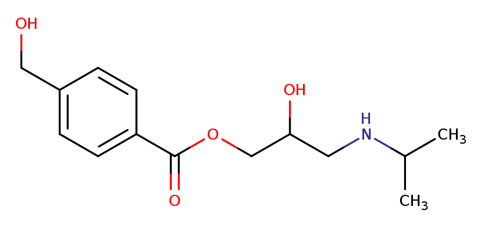

# Building minor_changes

There are two kinds of structure files needed for minor_changes. Both must
be of the form [dicer_data](/src/Molecule_Tools/dicer_fragments.proto).

1. Substituents
2. Linkers

In both cases, attachment points are marked by isotopic labels. For substituents
there will be one labelled atom in the molecule, whereas for linkers there will be two.

In order to preserve the relevance of the fragments, we generally choose to 
label the atoms by the atom type of the atom to which they used to be attached.

A substituent file might look like
```
O[3038CH3] iso: ATYPE smi: "O[3038CH3]" par: "CHEMBL6974" nat: 2 n: 1680 
N[6007CH]=N iso: ATYPE smi: "N[6007CH]=N" par: "CHEMBL509348" nat: 3 n: 1749 
C[9001CH2]C iso: ATYPE smi: "C[9001CH2]C" par: "CHEMBL1201933" nat: 3 n: 1792 
[3001NH2]CC iso: ATYPE smi: "[3001NH2]CC" par: "CHEMBL547407" nat: 3 n: 1835 
[3038NH2]C iso: ATYPE smi: "[3038NH2]C" par: "CHEMBL454492" nat: 2 n: 1907 
[3001SH]C iso: ATYPE smi: "[3001SH]C" par: "CHEMBL508166" nat: 2 n: 1944 
```
The first fragment is an alkyl alcohol, that was extracted from CHEMBL6974
having been attached to an atom with atom type 3038. In this case that is
the OC group attached to the aromatic ring.

The other OC group is branched at the Carbon atom. When this fragment is
joined to another molecule it will only to an atom that has been assigned
atom type 3038.


