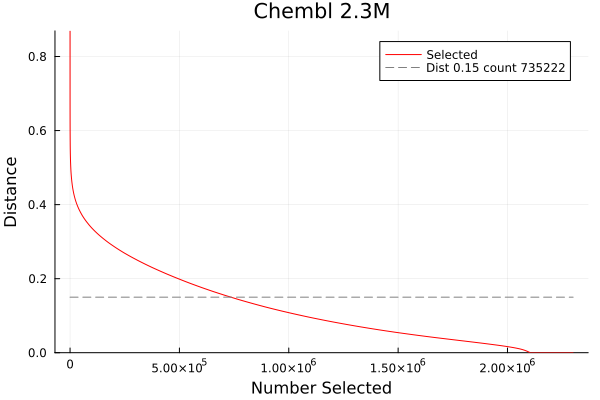
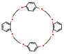
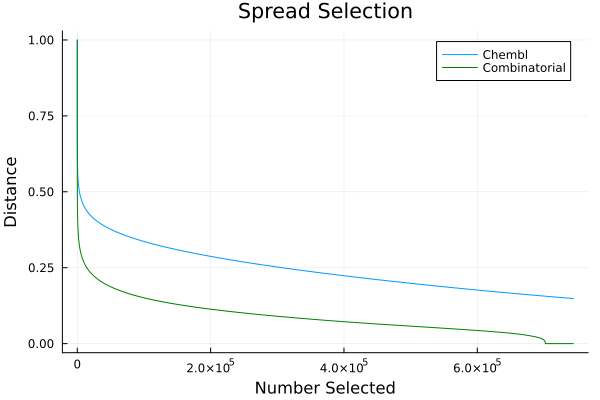

# gfp_spread

These tools perform a max/min type selection on a set of molecules,
selecting for maximum diversity.

## TLDR
```
# Generate fingerprints.
gfp_make.sh file.smi > file.gfp
# Run spread.
gfp_spread file.gfp > file.spr
# Post process into a smiles file.
nplotnn file.spr > file.spr.smi
```

## gfp_spread.
The LillyMol implementation of spread is a greedy approach to a hard problem.
For most Cheminformatics tasks this trade-off is just fine. But it is important
to note that we make no claim that this is an optimally diverse selection algorithm.

The first molecule (fingerprint) is selected - via various choices discussed below.
The second molecule will be the molecule that is furthest away from the first
selected molecule. The next molecule selected will be the one that is
furthest away from anything that has alread been selected.

A useful analogy is to think of getting onto an elevator (lift in Australia
and UK) with a group of strangers. Each new person takes a position as far away
from the existing strangers as possible. But by definition, as more people move into this
constrained space, each new person must take a position that is closer than ever
before to a stranger already there.

A similar thing happens with molecules selected via spread. As more and more
molecules are selected, the distance to a previously selected molecule must
monotonically decrease. If there are duplicates in the input, this distance
will decrease to zero. For a spread selection on a recent Chembl this
distance trajectory might look like



The first molecules selected are very likely to be "wierd and strange"
molecules. Indeed two of the very first molecules identified are
 



gfp_spread has correctly identified these molecules as being
significantly different from the first molecule selected. This is a
feature and not a bug.

This ability to identify the wierd and strange molecules can be
useful in identifying such entities. It is common for someone to
run spread on a large collection, observe some undesirable molecules,
remove them and run again.
[!NOTE] if you do this, and there was a close analogue of one of
the discarded molecules in the dataset, the second run may see
that analogue selected. Again, this is a feature, not a bug.

## How Many Molecules?
Spread is often used to answer the question "how many molecules
are in this set of molecules?". For example if offered 1000
molecules for diversity screening, if they are all close analogues, that
may be much less interesting than a set that contains significantly
more internal diversity. gfp_spread seems to be the best tool
for assessing the internal diversity of a set of molecules.

Looking at the trajectory plot above, we see that from Chembl we can
select 735k molecules without ever have any two molecules closer
than a 0.15 distance. For every molecule selected after 735k it will
be closer than 0.15 to something already selected. So if we were
looking to measure diversity saying that at a distance of 0.15
there are only 735k molecules in Chembl.

This measure of internal diversity seems quite robust and can be
applied to both large collections and small. It is however
expensive to compute.

## Diversity Comparison
Use a recently enumerated library of 740k molecules that were formed
from an acid + amine reaction. Run gfp_spread on that set of molecules
and superimpose that distance trajectory on what was found for Chembl.



As expected, we see there is substantially less diversity in the
combinatorially derived set of molecules than what is observed in
Chembl. We also see the influence of duplicates in the combinatorial
set.  If we consider 0.15 to be the threshold for diversity, we can
select 101k molecules from the combinatorial set - compared with
735k from Chembl. There are situations where large numbers of molecules
can be claimed, but in terms of diversity, the "real" number can be
much lower due to redunancies.

## HOWTO
A typical spread run will look something like.

First generate a fingerprint file.
```
gfp_make.sh file.smi > file.gfp
```
If you use the default fingerprint set, then you will be able to use
gfp_spread_standard. Otherwise either the serial version, gfp_spread,
or the parallel version gfp_spread_omp.

Run spread standard, use 8 threads
```
gfp_spread_standard -h 8 file.gfp > file.spr
```
[!WARNING] gfp_spread_standard has no default for the -h (number of threads)
option, it will by default attempt to use all CPU resource on the machine.
This may, or may not, be what you want. See [parallel](/docs/Molecule_Tools/parallel.md).

This can be a lengthy process. Once spread is complete, use nplotnn
to convert that to a smiles file, and  (optionally) generate a file that contains
the distance trajectory.
```
nplotnn -S spread.txt file.spr > file.spr.smi
```

The file `spread.txt` looks like
```
sel,distance
0,1
1,0.8692
2,0.8482
3,0.8296
4,0.8257
5,0.804
...
```
which can be imported into your favourite plotting package. The contrib
directory contains [spreadplot](/contrib/bin/spreadplot.jl) which is already
set up to generate plots using this file.

## First Item
By default, spread will choose the first item in the file to select first. The
`-S` option controls selection of the first item.

The help message looks like
```
 -S rand         randomly choose first item
 -S hsf          start with item with highest scale factor
 -S furthest     start with item furthest from all other items
 -S fff=nnn      start with item nnn times furthest from first item
```
Again, the default is to use the first item in the input fingerprint file.

### rand
The first item is selected randomly.

### hsf
We will discuss scaling factors below. Briefly, each item can be assigned
a weight, that correlates with some external measure of desirability.

### furthest
Each item is compared with all others - can be a length process. The item
that is furthest away from any other item is selected first.

### fff=nnn
Perform <nnn> steps where the first item is selected. Identify the item
furthest from that. Starting from that point, find the item furthest away.
This is an abbreviated form of `-S furthest`.

There is no right answer for which method to use. It depends on what you
are trying to accomplish. What we find is that in the absence of weighting
factors, similar molecules come to the front of the selection.

## Number to Select
While running a large dataset through a complete spread selection can be slow,
if you only need a relatively small number of items selected, use the `-n` option
which tells it to stop once the given number of items have been selected.

## Distance Based Stop
Use the `-t` option to stop selection once the nearest distance to a previously
selected item drops below the specified distance.

## Already Selected
If you have a set of molecules that have already been "selected", for example you might own them
already, and are looking for molecules to complement that set, specify those fingerprints
via the `-A` option. For large datasets, this can be a daunting calculation. See below.

This time the first molecule selected will be the new item whose closest distance
to anything previously selected is maximised.

If you are looking to use spread to augment a large collection with a large set of new
candidates, that can be daunting. 

Inside Lilly, use parallel_nn_search to perform a nearest neighbour search
between the candidates and the existing collection. You will need to 
split the candidate molecules first.
```
gfp_make.sh new.smi > new.gfp
iwsplit -n 2000 -suffix gfp -tdt new.gfp
parallel_nn_search -split iwsplit -n 10
```

Outside Lilly, use a tool like dopattern to launch multiple jobs searching
against the corporate collection.
```
gfp_make.sh new.smi > new.gfp
iwsplit -n 2000 -suffix gfp -tdt new.gfp
dopattern.sh -suffix gfp -parallel 16 'gfp_lnearneighbours -p %.gfp -n 10 /path/to/corporate/corp.gfp.gz > %.nn'
```
which is run 16 way parallel on the same machine. If you have a Grid Engine environment
available, that can be used with dopattern.

Either method will generate a series of nearest neighbour files. These can be passed
to `parallel_nn_search_to_gfp_spread` to convert to a format suitable for the `-A` option
to gfp_spread
```
parallel_nn_search_to_gfp_spread -F new.gfp -v *.nn > resultA.txt
gfp_spread -A resultA.txt ... new.gfp > new.spr
```
This way parallel and distributed computation can be used for what might
otherwise be a very lengthy calculation.

## Distance Scaling
Many times there is a need to choose a set of molecules that are both diverse, either 
just internally diverse, or diverse wrt an existing collection, and desirable. Desirable
being defined by any means - cost, properties, model score, other...

The spread tools handle this by assigning an optional weight to every fingerprint.
This should be a number between 1 and 0. As the next candidate is selected, the
nearest distance to a previously selected molecule is examined, but if there
is a scaling factor present, then a scaled distance is used. So if two unselected
fingerprints have the same distance, the more desirable one will be selected.
And one fingerprint has a distance of 0.3 but a weight of just 0.5 (product 0.15)
and another has a distance of 0.2, but a weight of 1.0 (product 0.2), the
second one, less diverse, will be selected - because it is overall more
desirable. A molecule becomes desirable both for being diverse and for
being intrinsically attractive. This scaling factor is a means of including both
measures in a selection.

This is frequently done in order to prioritise molecules for purchase, screening
and other purposes. A similar functionality is built into the gfp_leader tools
and you should examine both in order to decide which one is most appropriate for
any given scenario.

The per fingerprint scaling can be specified in a variety of ways. The most straightforward
is to include the scaling in the starting smiles file
```
smiles1 ID1 0.7
smiles2 ID2 0.9
smiles3 ID3 0.1
smiles4 ID4 1.0
```
Then generate fingerprints and use `-p COL=2` with gfp_spread. This says that the
scaling factor is in column 2 of the name field. It is column 3 in the smiles file
but column 2 in the name field.

Another way is to store the id's and scaling factors in a separate file, scale.dat
```
ID Scale
ID1 0.7
ID2 0.9
ID3 0.1
ID4 1.0
```
and run
```
gfp_spread -p FILE=scale.dat ...
```

A less common use is to include the scaling factor as a separate item in the gfp file,
`-p tag`. This turns out to be inconvenient and nobody uses it these days.

## Report Progress
Since spread can take a long time to run, the `-r` option can be used to have it report
to stderr every <n> molecules selected. You can also monitor creation of the output
file, but that may become expensive as the size of the file increases.

## Miscellaneous Options
The -M option includes obscure options
```
 -M recomp       recompute distance if no nbrs found
 -M nscale       include scale factor of nbr with scale
 -M squeeze=nnn  squeeze out selected molecules evern <nnn> steps
 -M ldist=<dist> all distances truncated to <dist>
 -M blurr=<nn>   blurr distances so there are only <nn> values. Should be > 10.
```

### recomp
Most gfp tools have a -W option, which allows imposition of an atom count
difference window when doing comparisons. This can significantly speed calculations,
but at the risk of missing a neighbour that desipte having a very different atom count
would be found to be similar if the calculation had been done.

If there is an atom count window in effect during processing of the -A option, it
is possible there will be molecules that have never been assigned a distance
to previously selected value. The `-M recomp` option means that if this is found
to be the case, the -A file will be re-scanned, without the window, and a
distance computed.

### nscale
When a distance is computed, it consists of both the scaling factor of
the unselected molecule, but also the scaling factor of the previously
selected molecule. This further diminishes the possibility of sampling
from otherwise low desirability areas of structure space.

### squeeze
This is very important for performance. Internally the candidate fingerprints
are stored in an array. As fingerprints are selected, they need to be
checked and skipped as the array is scanned. Once there are a significant
number of molecules selected, it makes sense to squeeze the already
selected molecules out of the array of unselected fingerprints. There
is no "right" value for this, but often 1000 seems to work well.

### ldist
All distances beyond the value specified are truncated. The original use
case for this is lost in history. Perhaps an attempt to lower the
probability of highly extreme molecules being selected. Cannot see
a use case for this today.

### blurr
Similarity/distance values are continuous, floating point values that
can assume a large number of different values. But it is unrealistic
to say that a distance of 0.0345 is shorter than a distance of 0.0346.
Mathematically that is true, but in terms of similarity, there is
nothing to distinguish the pairs. With the `-M blurr=nn` option in
effect all distances are rounded to common values so that there are
<nn> discrete values. The range [0,1] is subdivided into <nn> buckets
and all computed distances are assigned an integer bucket number
which has an associated floating point distance.

This was an attempt to introduce some stochastic aspects into gfp_spread.

## Tversky
While gfp_spread does support a -V option for Tversky similarities,
I don't think there has ever been a use case for this.

# gfp_spread_standard gfp_spread_omp.sh
These are parallel versions that enable large collections to be run
in reasonable times. `gfp_spread_standard` only works with the 
standard set of fingerprints, while `gfp_spread_omp` works with any
valid set of fingerprints. As much as possible, we have tried
to keep the options and functionality as close to the serial
version as possible. Several of the experimental features
added to `gfp_spread` have not been implemented in the parallel
versions.

# gfp_spread_buckets
This is a variant of spread where each item in the input is assigned
to a bucket. This can be any kind of classification. For example it
might be which vendor supplied the molecule, from which project did
the molecule come, at which target has the molecule been most active,
from a range of measured values, etc.  As molecules are selected, the
tool ensures that there is uniform selection from the buckets.  So the
next item will not necessarily be the furthest from anything already
selected, it will be an item in a bucket, from which something must be
selected, that is the furthest from anything already selected -
regardless of bucket.

This has proven useful several times ensuring a uniform distribution of
attributes in a selection.

Most of the options remain the same as the non-bucket version, but you need
to tell it the bucket assignment for each fingerprint. Generally this
will be by adding an extra token to the name field
```
gfp_spread_buckets -B col=2 ...
```
In default mode, it ensures that there will an equal number of selections
made from each bucket, before a subsequent selection is made from any
other bucket. So first there will a single item selected from each bucket.
It will then scan the list of candidates and find zero available. It
then increments the number of times selected from buckets and will then
continue the search, this time allowing an extra item to be selected
from each bucket.

And of course, an individual bucket may become exhausted, in which case
it is removed from consideration.

There is a penalty/scaling function available for allowing some
level of violation of equal selection, however I am not sure why
that was implemented, and it is unclear if it works properly.
As an atom is considered for selection, it will only actually be
selected if it belongs to a bucket that has been selected less
