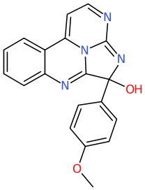
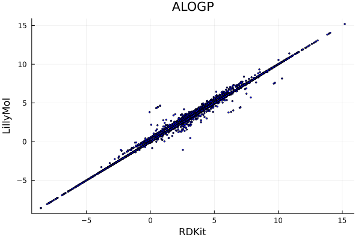
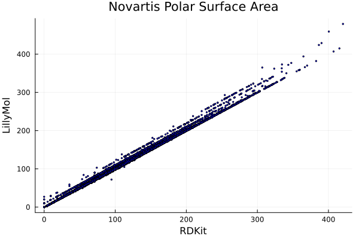

# QED

QED is often used for prioritising molecules.

While I generally don't use it, many people do use QED.

I would prefer a more comprehensive alert system, Lilly Medchem
Rules for example, and some of the weights applied are probably
not what I would choose.

The reason for using the LillyMol QED implementation is speed. On
a random set of 100k molecules from Chembl, the RDKit version will
take about 78 seconds to process. The LillyMol version takes about
23 seconds to process the same set, 3.4x faster. Relative timing
can depend on the size of the molecules.

## HowTo
```
./contrib/bin/QED.sh file.smi > file.qed
```
will generate a two column output with the ID and QED score for
each molecule. Add the -a option to also include the individual
components of the QED computation.

## Details
As other implementations of QED have observed, there will be
variability among implementations, often due to differening
discernment of aromaticity. The same is the case here, complicated
by the chemical standardisation process used by LillyMol applications.

The overall agreement between the RDKit implementation and the
LillyMol implementation is reasonable. The R2 is 0.994206. The
average absolute difference is 0.00258164 and RMS 0.0164326. 99%
of values are within 0.103. Graphically this looks like
. Remember, 99% of differences are within
0.01, but the plot emphasises the relatively small number of molecules
with differences.

Remember too that QED is not a precise estimate of a physical
quantity, it is a model for measures of drug-likeness.

Some of these differences are due to differences in aromaticity
perception. For example, the ring system in

is considered aromatic by LillyMol, but not by RDKit, so this
molecule is assigned an extra alert by LillyMol. Hard to know
which is more correct.

A potentially more serious discrepancy comes from the query 
```
[OR0,NR0][OR0,NR0]
```
which is an Oxygen or Nitrogen, neither in a ring, singly bonded to
another Oxygen or Nitrogen. But if Nitro groups are represented
in their charge separated forms, this alert will also match
all Nitro groups. My guess is that this is not what was
intended, but I don't know.

There are also differences in alogp and PSA estimates, due
to ambiguities in the original publications, and differing
aromaticity definitions (and presumably bugs). The alogp
values look like

and PSA

Most of the banded differences shown can be attributed to
differences associated with a particular functional group, or
aromatic form. These could be investigated, but the usual
outcome from that is neither implementation is obviously
right or wrong.

## Future
Many of the Alerts smarts are not written in efficient forms and
could be restructured.

There are queries that do not match when run across 100k Chembl
molecules. Perhaps the queries are wrong in some way, or perhaps
there are incompatibilities with the LillyMol standardisation.

If we run the queries against 100k Chembl molecules, RDKit
substructure matching matches 53908. Using LillyMol matching
without standardisation sees 53920 matched. Differences are
largely due to aromaticity differences. If LillyMol
standardisation is turned on that becomes 53915, but
even though the overall numbers are close, there are
53 differences. This seems close enough, especially since
QED is a model.

Currently the only weighting scheme implemented is the 
Mean weight scheme. It would be easy to enable the other
forms.
