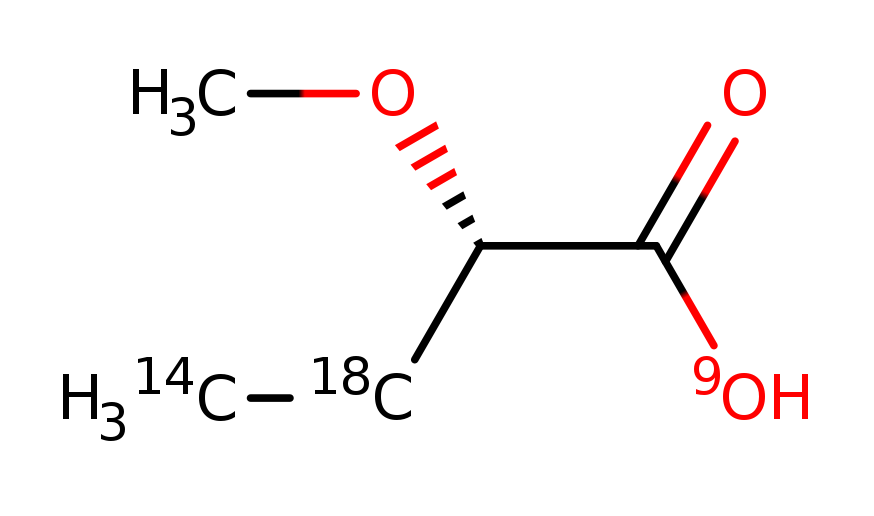
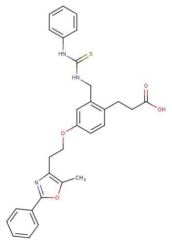
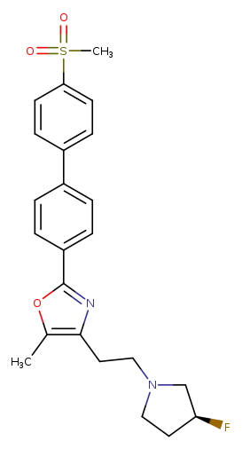

# QupKake
QupKake is an an innovative pK predictor from Abarbanel and Hutchison 
[JCIM](https://pubs.acs.org/doi/10.1021/acs.jctc.4c00328). Their method
uses a combination of QM computations and Machine Learning to generate
predictions of likey local pK<sub>a</sub>.

But as might reasonably be expected, inference on new molecules will not
be fast.

The LillyMol tool qupkake_transfer operates on a series of QupKake calculations
that have been performed. For each calculation available, it extracts a micro
environment around the atom of interest and stores the unique smiles of that
fragment in a database. When an unknown molecule is to be scored, it applies
the same fragment reduction algorithm to the unknown molecule and looks up
the fragments in the database. If it finds a match it will suggest that as
a plausble value for the unknkwown molecule

The obvious way to solve this problem would be:

```
for each unknown molecule
  for each known molecule
    compute MCS
```
and determine the best match to known sites. But this is obviously infeasible,
so we take the usual shortcut of approximating an MCS with fixed fragmentation
rules.

Dicer fragments would be a possible choice, but here there are extra considerations
around just how to define boundaries of fragments, so a custom set of rules was
implemented. This will never be good enough, and there is a constant tension between
making the rules more and more precise, which leads to more precise/better matches, 
and less precise rules which will result in more matches, possibly at the expense
of less relevant matches. There are no free lunches here.

[!NOTE]
More work needs to be done on the fragment identification in `qupkake_transfer`.
Some fragments are too small and some are too large. TODO:ianwatson work on this.

## Building the Database.
### Post Processing QupKake output.
We observe that one of the outputs from a QupKake computation is a series of
sdf files that might end with something like
```
  26 49  1  0
  26 50  1  0
  M  END
  >  <idx>  (1) 
  5

  >  <pka_type>  (1) 
  basic

  >  <pka>  (1) 
  7.144966

  $$$$
```
Where \<idx\> is the atom number (indexed at 0) of the atom of interest,
\<pka_type\> will be either 'acidic' or 'basic' and \<pka\> will be the
computed value.

Across all computations done, gather a list of all those .sdf files. Then
use numbered_smiles to convert to smiles.
```
numbered_smiles -v -i ALLSDFID -S first_step $(cat /tmp/files)
```

This yields records that might look like
```
C[1CH2][2CH2][3CH2][4NH2] idnumber idx:4 pka_type:basic pka:8.846232
```
Where the atoms have an isotopic label according to their atom number,
indexed at zero, in the .sdf file.

The python tool [qupkake_to_isotope](/contrib/bin/qupkake_to_isotope.py)
takes this output and uses the value if 'idx' and 'pka' to create a molecule
that looks like

```
CCCC[884NH2] idnumber basic
```
where the pka value has been multiplied by 1000 and placed as an isotope
on atom 'idx'.

## Epik
Schrodinger's Pka tool can also be used as input.
The tool [from_epik](/contrib/bin/from_epik.py) converts Epik data to
a form used by this tool. On a recent set of 200 data files I ran
```
dopattern.sh -o 200 'run_python.sh from_epik.py iwsplit%.smi epik-iwsplit%.log > from_epik%.smi'
qupkake_transfer -d Epik.bdb -c from_epik*.smi
```

### Build a BerkekeyDB database
Given the output from qupkake_to_isotope build a BerkeleyDB database with
```
qupkake_transfer -S Sfile -d STORE -d qupkake.bdb from_qupkake.smi
```
This builds `qupkake.bdb` which will later be used for lookups, but more
interestingly the file `Sfile`. 

In this file all examples of each fragment are grouped. This can be particularly interesting
in understanding the data.

A typical entry might look like
```
[9OH]C(=O)[C@@H](OC)[18CH2][14CH3] acid 1 base 5
PBCHM58822690 acid 3.624
acid 1 values btw 3.624 ave 3.624 3.624 range 0 median 3.624
PBCHM58822697 base 1.882
PBCHM18443639 base 1.904
PBCHM58823011 base 1.912
PBCHM9908200 base 1.94
PBCHM10135109 base 1.971
base 5 values btw 1.882 ave 1.9218 1.971 range 0.08899999 median 1.912
[9n]1c2[n]([n]c[50cH]c2)c[18cH]1 acid 0 base 1
```
The first line shows an isotopically labelled fragment.


The isotopes indicate atom types of the environment from which this
fragment was excised, and helps make matching more precise. See the
discussion of this above. Isotope 9 is "special". It is the isotope
of the atom of interest.

This particular fragment is unremarkable. There is just one example of
this fragment as an acidid, but five structures where this fragment
has been computed as a base. All values are closely grouped, so
this indicates that this fragment classification is likely fairly
good.

But there are other cases that show interesting things. Consider
```
o1[40cH][44cH][9n][18cH]1 acid 0 base 38
PBCHM10282849 base 1.55
PBCHM59786007 base 1.632
PBCHM12083251 base 1.661
PBCHM10209774 base 1.681
PBCHM58979084 base 1.7
PBCHM12083254 base 1.742
PBCHM12083256 base 1.743
PBCHM10184907 base 1.744
PBCHM22261192 base 1.761
PBCHM12083258 base 1.772
PBCHM58979497 base 1.786
PBCHM12966838 base 1.788
PBCHM22633474 base 1.797
PBCHM22633492 base 1.801
PBCHM22633452 base 1.821
PBCHM10229320 base 1.83
PBCHM22633463 base 1.836
PBCHM58979296 base 1.837
PBCHM10188278 base 1.852
PBCHM58979169 base 1.856
PBCHM22261133 base 1.863
PBCHM10298366 base 1.874
PBCHM22261233 base 1.922
PBCHM10141705 base 1.996
PBCHM18692614 base 2.182
PBCHM58979270 base 2.449
PBCHM11597125 base 7.198
PBCHM58951439 base 7.301
PBCHM58951484 base 8.534
PBCHM58951486 base 8.587
PBCHM58951385 base 9.041
PBCHM58951424 base 9.105
PBCHM58951396 base 9.201
PBCHM58951422 base 9.268
PBCHM11560594 base 9.269
PBCHM58951466 base 9.317
PBCHM11626011 base 9.349
PBCHM11581639 base 10.055
base 38 values btw 1.55 ave 4.044763 10.055 range 8.505 median 2.1855
```
for which the fragment is
![o1[40cH][44cH][9n][18cH]1](Images/qupkake2.png)

We see 26 values that range from 1.55 to 1.99 which seems quite reasonable.
But then there is a jump to much higher values. Consider the two
structures either side of this divide.

and


The micro environment around the fragment of interest is quite similar, but what
is different is the presence of a much stronger base elsewhere in the
molecule - the Pyrrolidine.

This points to a fundamental limitation in the approach. qupkake_transfer is
built on the premise of locality of values, but as this example clearly shows
that is not necessarily the case in molecules with multiple acids or bases.

In an attempt to mitigate this issue, we can pre-filter the QupKake results
to retain on the strongest acid and strongest base from any molecule. The script
[strongest_acid_base](/contrib/bin/strongest_acid_base.rb) does this, consuming
the output of numbered_smiles above, and generating a file containing only the
strongest acid and base for each molecule.

However even this does not solve all problems. We will still observe cases like
```
id1 acid 2.266
id2 acid 10.558
id3 acid 10.795
id4 acid 11.015
id5 acid 11.261
id6 acid 11.262
id7 acid 11.318
```
These structures cannot be shown here. The calculation involves an aniline
like group, and for 48 of 49 examples, the computed value is 10.5 or above.
But there is one computation showing a value of 2.26. In that case the
molecule also has a carboxyllic acid whose computed value is 2.69, so the 2.26
value is returned as the lowest value. I don't know enough about how the
QM computations are done to offer any ideas on what might be going on here.
For this reason where multiple values are available, the median value is
more likely to be of interest rather than the mean.

### Fragment Size
We observe that sometimes very small fragments are selected, two atoms.
This may be too small for valid comparisons, so the `-m` option when
loading the database makes an extra pass over the fragment of interest
to try and add atoms till it gets to the required minimum size. It only
expands one layer, so it may not be able to satisfy the request._

## Using the Database
Once the database is built it can be queried via
```
qupkake_transfer -d /path/to/database.bdb -d LOOKUP file.smi
```
This might be a lengthy process since it must look up all possible
sites - Nitrogen, Oxygen and Sulphur atoms, in the input moleucles.
You can use the -s option to focus the search on particular sites
```
qupkake_transfer -s '[OH]-c' -d /path/to/database.bdb -d LOOKUP file.smi
```
will only look up phenolic oxygen atoms.

The proto stored in the database contains the ID of the molecule that
generated the result, but the structure associated with that ID is not.
If you wish to see the structures in the output, use one or more -G 
options to specify 'selimsteg' type databases that specify a relationship
from identifier to smiles
```
qupkake_transfer -G /path/to/lly/selimsteg.bdb -d /path/to/database.bdb -d LOOKUP file.smi
```
in the case of Lilly, id's are stored in the selimsteg database zero padded to 12 characters,
but the database of QupKake results might have leading zero's stripped. In that case
modify to
```
qupkake_transfer -G /path/to/lly/selimsteg.bdb,ZPAD=12 -d /path/to/database.bdb -d LOOKUP file.smi
```
The 'qupkake_transfer.sh' script does this for you.

The current usage is for these matches to be manually reviewed - decide
whether or not you believe the database fragment is an adequate equivalent
for the environment of the group in the new molecule or not.

The output might look like
```
N1(CCN(CCC[9NH2])CC1)CCCN CHEMBL41307 [9ND1H2v1]
[24NH2][98CH2]CC[9NH2] acid 1 11.514 11.514 11.514
[24NH2][98CH2]CC[9NH2] base 1 10.521 10.521 10.521
C1(=CC=C(OC2CCN(C)CC2)N=C1)C(=O)[9NH2] CHEMBL4577942 [9ND1H2v1]
O=C([9NH2])c1c[n][144cH]cc1 acid 56 10.891 11.75346 12.137
O=C([9NH2])c1c[n][144cH]cc1 base 56 6.262 8.048267 9.456
```
The first record is the input molecule with isotope 9 applied to the atom of interest.
Then follow lines for acid or base database matches - if found.

Each such line starts with the unique smiles of the fragment, with isotope 9
on the atom of interest, and other isotopes indicating atom types. A line like
```
[24NH2][98CH2]CC[9NH2] acid 1 11.514 11.514 11.514
```
indicates that there was one database entry for this fragment, and the
min, average and max are all the same.

For the second molecule we observe 56 database entries for that fragment, with
acidic values ranging from 10.891 to 12.137.

These runs were done without a selimsteg -G database, but when that is
available, the smiles and ID's of the fragments are shown.
````
[14CH3][18O]CC[9N]1CCCCC1 base 4 8.399 8.57925 9.079
smiles1 id1 8.417 base
smiles2 id2 8.422 base
smiles3 id3 9.079 base
smiles4 id2 8.399 base
````
The same summary statistics are written, but this time each database
molecule containing that fragmnet is written. The idea that a human
will manually review these and make decisions about which transferred
fragments are most likely to represent a likely value for the unknown
molecule.

### Limiting the Output
It is possible for a database to contain a great many replicates of a given
fragment. The `-n` option controls the maximum number of examples to show.
Those are sampled uniformly across the set of examples stored.

### Details
The fragments retrieved will have isotopic labels.
```
o1[40cH][18cH]c2c1cc([144cH]c2)C[9N]1CCOCC1
```
for example. By convention isotope 9 is used for the site of interest. Other isotopic labels
are applied at points where the fragment joined to the donor molecule, and generally
reflect the atom type of the atom which used to be attached. This atom typing is
simplistic, see the source code if interested [qupkake_transfer.cc](/src/Molecule_Tools_Bdb/qupkake_transfer.cc).
