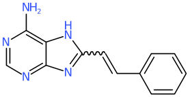
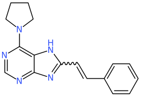

# fingerprint_substructure

`fingerprint_substructure` generates fingerprints for a subset of the atoms in
a molecule. The subset is defined by a query, and an optional radius.

This can be useful in the case of a set of reagents, and you want to know,
within a given radius, how many different reagents are there? If you try
to do that with actual molecules, you run into problems with rings and such
that get destroyed if certain subsets are formed. Fingerprinting the
subset of atoms solves that problem.

# Minimal Example
Assemble a set of acids.  
```
tsubstructure -s '1[OD1H]-C=O' -m acid -v haystack.smi
```
Fingerprint the acid and 3 atoms out
``` 
fingerprint_substructure -v -s '[OD1H]-C=O' -x 3 -J FPSUB acid.smi > acid.gfp
```
By default, it produces a linear path fingerprint. A newer version of this tool
is able to make any kind of fingerprint.

Run leader/sphere exclusion on the resulting fingerprint file with a small
radius in order to group common acids - common to 3 atoms from the acid.
```
gfp_leader_v2  -t 0.01 acid.gfp > acid.ldr
nplotnn -L def acid.ldr > acid.ldr.smi
```
which contains things like
```
CNCC(=O)O EN300-20732 CLUSTER 6 (143 members)
OC(=O)CNC1CC1 EN300-42543 CLUSTER 6.1 1 0
CCCNCC(=O)O EN300-51247 CLUSTER 6.2 2 0
CC(C)NCC(=O)O EN300-33393 CLUSTER 6.3 3 0
NC(=O)NCC(=O)O EN300-10397 CLUSTER 6.4 4 0
OC(=O)CNC(=O)C=C EN300-222214 CLUSTER 6.5 5 0
COCCNCC(=O)O EN300-77920 CLUSTER 6.6 6 0
CC(C)(C)NCC(=O)O EN300-54858 CLUSTER 6.7 7 0
CNC(=O)NCC(=O)O EN300-36911 CLUSTER 6.8 8 0
COC1=C(C=CC(=C1)S(=O)(=O)NC1=CC=C(C=C1)C(=O)NCC(=O)O)NC(=O)C EN300-11702 CLUSTER 6.142 142 0
```
all these molecules present the same 3 atom radius context around the acid.


## Usage
The following options are recognised
```
Fingerprints just a subset of the atoms in a molecule
  -q ...        query specifications for identifying the subset
  -s <smarts>   smarts to identify the subset
  -x <number>   include atoms within <number> atoms of the subset
  -z i          ignore molecules not hitting any queries
  -z e          fingerprint each substructure match 
  -z f          if multiple matches, take the first
  -S in=TAG     tag for reading smiles
  -S out=TAG    tag for writing smiles
  -S iso=TAG    tag for isotopically labelled molecules in output
  -N <tag>      tag for the number of atoms in the subset
  -I <stem>     file name stem for isotopically labelled subset molecules
  -Y ...        standard fingerprint options
  -j <n>        join disconnected sections <n> or closer bonds
  -J <tag>      tag to use for fingerprints
  -P ...        atom typing specification, enter '-P help' for info
  -M            produce atom pair fingerprints
  -f            work as a filter
  -e            truncate any counted fingerprint to 0/1
  -l            reduce to largest fragment
  -i <type>     input specification
  -g ...        chemical standardisation options
  -E ...        standard element specifications
  -A ...        standard aromaticity specifications
  -v            verbose output
```

The matched atoms that define the subset must be defined by one or more queries.
Queries are tried until one matches. It is therefore very important that the
atom ordering across multiple queries be consistent with the subset intention. The
`-z` option controls how to handle cases of multiple or zero matches.

The `-x` option is very important and defines a radius around the matched atoms
that also get fingerprinted.

The `-S` option is used if this tool is being used as part of a TDT pipeline (the `-f` option).
In that case, it may be useful to add the number of atoms in the subset via the `-N` option. This 
includes the atoms brought in via the `-x` option

As an alternative to the `-S iso=TAG` construct, isotopically labelled subsets
can be written to the `-I` file.

The `-M` option means that within the matched (and expanded) atoms, atom pair
fingerprints will be generated. The new version also allows EC type fingerprints.

The `-P` option allows for custom atom typing, which will apply to all fingerprints
generated.

## Down The Bond
Rather than a fixed radius from matched atoms, we can instead use the query to
identify a substituent. The -d option allows specification of two matched
atoms where the first matched atom defines an anchor, and the second matched
atom the first atom in the substituent. All atoms in the substituent are
included in the subset of atoms fingerprinted.

For example to examine substituents at an indole, one might try
```
fingerprint_substructure -s ' n1c2aaana2aa1-!@[R0]' -d 8-9 -J FPS file.smi > file.gfp
```

and we find that these two structures


are identical and

is a near neighbour.

The -x option also works, which can add more context to the matches. Adding
'-x 3' now finds matches like

and

to be identical. The substituent is an ethyl in both cases, and the
substituents on the ring, to 3 bonds, are identical.

Using the down the bond construct here is basically equivalent to 
detaching the substituents, possibly with a part of the scaffold
and fingerprinting fragment. This is just more convenient, and
may be useful helping to understand an SAR series.
