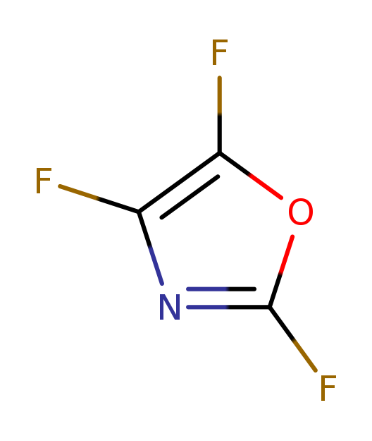
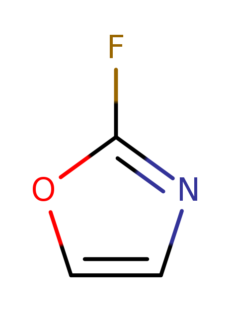
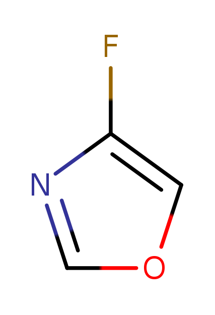
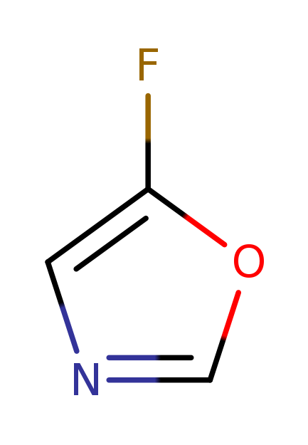

# positional_analogue_scanning

This is from the publication [ACS](https://pubs.acs.org/doi/10.1021/acs.jmedchem.9b02092)
and borrowing ideas from the implementation by [Pat Walters](https://practicalcheminformatics.blogspot.com/2020/04/positional-analogue-scanning.html#:~:text=This%20is%20a%20simple%2C%20yet%20powerful%2C%20technique%20where,each%20aromatic%20%22cH%22%20is%20sequentially%20replaced%20with%20nitrogen)

The fundamental idea is straightforward, different kinds of atoms can be systematically added to
an existing molecule, or where an existing atom can be transformed to another type.

As the authors note, despite the changes being minor from a connection table perspective,
even minor changes to an existing molecule may be very difficult to make, so there is
no guarantee that the molecules proposed will be successful.

Within the LillyMol distribution there are a couple of implementations of this
idea, but I think there may be easier ways.

If you are interested in changing the kind of element for a ring atom, I would instead
recommend using the LillyMol ring replacement tool [link](ring_replacement.md). This should
significantly lower the chances of forming unprecedented rings, which will likely
result in suggestions being, at a minimum, de-prioritised by Chemists. Using the
ring replacement tool, possibly with a formula difference constraint, should enable
generation of potentially interesting molecules with different rings, while
retaining the minor change philosophy of Positional Analogue Scanning.

## Chain Atoms
One of the ideas put forward is the idea of adding a methyl group to likely sites.
This can also be done via [trxn[(trxn.md). For example a reaction to add a Fluorine
atom to an aromatic carbon might look like
```
name: "Positional Analogue Scanning"
scaffold {
  id: 0
  smarts: "[cD2H]"
}
sidechain {
  id: 1
  reagent: "F"
  smarts: "*"
  join {
    a1: 0
    a2: 0
    btype: SS_SINGLE_BOND
  }
}
```
and when invoked as
```
trxn -P pas.rxn -z i -m each file.smi
```
will generate all plausible, single F addition, products. The important option is
`-m each` which says that for each scaffold match, generate a new molecule with
the reaction happening at each site separately. Without that option, trxn will generate products
like

rather than the separate products




And if you wish to add different types of substituents, that can be done via either
adding more 'reagent' attributes to the 'sidechain' message
```
  reagent: "F"
  reagent: "O"
```
Or by building a file of reagents to add, possibly isotopically labelled to make
the reaction easier, and running trxn with that sidechain file on the command line - 
and no 'reagent' attributes in the 'sidechain' message.

## minor_changes
Note that systematic addition of a fragment to a molecule is one of the operations
performed by [minor_changes](minor_changes.md), via the `add_fragments` directive.

## Recursion.
If you wish to add a second group to a different site, thereby generating bifunctional
products, that cannot be done with trxn. We can get an approximation to that by
changing `-m each` to `-m 2` which means when there are multiple
matches, process the first two matches only as a group. So while we do get
di-substituted products generated, it will not be exhaustive.

Another way to get what is needed is to run trxn once, with
the `-m each` option, to generate the singly substituted molecules, and then run it again on those
product molecules to add a second functional group to other sites. The final result would be 
the concatenation of the first trxn invocation that generated singly substituted
products, and the second, which generated the doubly substituted products.

This works regardless of how many different groups are being added. In the first
invocation all substituents are indivudually added to each site. Then on the
second invocation, all fragments get added, one at a time, to the remaining
sites.

If you have just one fragment being added this result is complete. If you had
multiple fragments and only wanted to have sets of each single fragment added,
that would need to be done one fragment at a time. But that seems less useful.

### Combinatorics
Beware combinatorics of this approach - which also applies to `minor_changes`.
Taking 10k random Chembl molecules
```
10000 molecules had between 5 and 50 atoms. Average 27.9344

```
and adding **one** of either F or O to each
open aromatic Carbon atom results in 134k molecules. Starting with the products
of this first reaction and enerating the next round of
di-substituted products generated 2.1M molecules and took 26 seconds to compute.
Overall the 10k starting molecules have turned into 2.2M.
