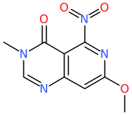

# Ring Replacement

## Motivation
Given a molecule of interest, frequently there is interest in variants of
that molecule. While similarity searching can identify existing molecules
that might be similar to a molecule, that does not answer the question
of what plausible variants might exist?

`ring_replacement` takes a starting molecule, a database of known rings,
and generates molecules that have the existing rings replaced by rings
from the database. The way the database is constructed, ring sizes and
substitution patterns are preserved. So if the starting molecule
is a para substituted benzene ring, the results will also be para
substituted 6 membered aromatic rings.

For example of the starting molecule is
```
Clc1ccc(F)cc1 p-benzene
```
requesting replacement of the 6 membered aromatic
```
ring_replacement -R rings_6a.smi p-benzene.smi
```
generates 185 new molecules. The first 10 (from Chembl) of those are
```
Cl[1c]1cc[1c](F)cc1 p-benzene %% CHEMBL503634.6a 1496512
Cl[1c]1c[n][1c](F)cc1 p-benzene %% CHEMBL156037.6a 83606
Cl[1c]1[n]c[1c](F)cc1 p-benzene %% CHEMBL156037.6a 83606
Cl[1c]1[n]c[1c](F)c[n]1 p-benzene %% CHEMBL1171471.6a 19926
Cl[1c]1c[n][1c](F)[n]c1 p-benzene %% CHEMBL1171471.6a 19926
Cl[1c]1[n][n][1c](F)cc1 p-benzene %% CHEMBL600052.6a 10360
Cl[1c]1[n]c[1c](F)[n]c1 p-benzene %% CHEMBL268339.6a 7938
Cl[1c]1cc[1n+](F)cc1 p-benzene %% CHEMBL505408.6a 6908
Cl[1n+]1cc[1c](F)cc1 p-benzene %% CHEMBL505408.6a 6908
```
The output consists of the smiles of the new molecule.  The name of
the starting molecule.  Then follows the name of an exemplar molecule,
that contains an example of the ring that has been
inserted.  The `6a` suffix indicates that the replacement is a six
membered aromatic.  The last token is the number of these rings found
in the knowledge base.  The output is sorted by occurrence.

Note that due to symmetry, many of the replacement rings are used twice.

Clearly the larger the number of examples of a ring in the
knowledge base, the higher the probability that this ring
might be synthietically feasible. Experience tells us that rings 
with low numbers of exemplars should be treated with caution.
While some may represent real molecules that have been made,
many seem more likely to have been drawing errors, or aspirations.
For example:
```
Fc1[c+]c[n+](Cl)cc1 pbenzene %% PBCHM59575064.6a 2
Fc1ccc(Cl)[p][p]1 pbenzene %% PBCHM159136080.6a 2
Fc1c[nH][n](Cl)so1 pbenzene %% PBCHM144506470.6a 2
Fc1[c-][o+]c(Cl)cc1 pbenzene %% PBCHM139100082.6a 2
```
are rings that have only two examples in the knowledge base.

## Usage
In order to make ring replacement work, two procedures are required.
1. Scan one or more collections of known molecules and extract the rings.
2. Use those knowledge bases to perform replacements.

# ring_extraction
ring_extraction is the tool that gathers data on the existing collections.
The following options are recognised.

```
Extracts rings and ring systems creating ReplacementRing protos that can be used by ring_replacement
 -S <stem>         create ring data files with <stem>
 -R <rsize>        max ring size to process (def 7)
 -Z <size>         max ring system size to process (def 3)
 -k                also generate smarts with connectivity not specified
 -a                transform within ring aliphatic double bonds to type any\n";
 -P <atype>        label atoms by atom type of exocyclic attached atom
 -X ...            more options
 -c                remove chirality
 -g ...            chemical standardisation
 -l                strip to largest fragment
 -v                verbose output
```
A common usage might be
```
ring_extraction -A 2 -S collection -k -c -l -g all -v collection.smi
```
for several different collections (corporate, chembl, pubchem, ...). Might be a good
idea to do each one in a separate directory.

The `-A 2` option combination tells the tool to consider rings that have
only 2 pi electrons to be aromatic. This is usually 4 membered rings, that
can usefully be considered aromatic.

```
mkdir corporate
cd corporate
ring_extraction -A 2 -S rings -k -c -l -g all -v /path/to/corporate.smi
cd ..
mkdir chembl
cd chembl
ring_extraction -A 2 -S rings -k -c -l -g all -v /path/to/chembl.smi
cd ..
mkdir ...
```


## Naming convention.
We adopt an idea from smarts in that aromatic atoms are represented
as lowercase and aliphatic as uppercase. So the file containing data
on 6 membered aromatic rings will be `rings_6a.smi` and the file containing
data on 6 membered aliphatic rings will be `rings_6A.smi`.

In the case of fused rings, there will be multiple ring sizes and aromaticity,
so a benzimidazole ring would be found in `rings_5a6a.smi`. Names are always
sorted from smallest to largest ring. The file `3A6a6A.smi` contains
fused (or possibly spiro fused) systems consisting of a
. 3 membered aliphatic
. 6 membered aromatic
. 6 membered aliphatic

Such a dataitem might be
```
smi: "[1CH]1=C2CCC3(CC3)OC2=N[1CH]=N1"
     smt: "[ax2r6D3]1:[ax3r6r6D3]2:[ax2r6D2]:[ax2r6D2]:[ax4r3r6D4]3(:[ax2r3D2]:[ax2r3D2]:3):[ax2r6D2]:[ax3r6r6D3]:2:[ax2r6D2]:[ax2r6D3]:[ax2r6D2]:1"
     id: "SCHEMBL2706866" n: 126 conn: true usmi: "O1C2(CCc3c1[n][1cH][n][1cH]3)CC2"
```
which includes a spiro fused 3 membered ring.

Note that the default setting of imposing a maximum ring system size of 3
will exclude a common motif of four rings, with a spiro fusion in the
middle. Adjust the -Z option as needed.

The letters 'a' and 'A' can be changed via the `-X` option
to `ring_extraction`. This may be important on file systems where file names
are case insensitive, where the files 'rings_5a.smi' and 'rings_5A.smi' cannot
coexist. See the '-X' option.

On a fairly old computer (2014), running ring extraction on 2.2M Chembl molecules
takes 5 minutes. Newer hardware will see that done in under 2 minutes.

## Details - TLDR, for geeks only.

In each directory there will be a number of files of the form `rings_*.smi`.
The naming describes what kind of rings are in that file. For
example `rings_6a.smi` contains the 6 membered rings from the collection. That
file might contain entries that look like
```
smi: "[1CH]1=[1CH]C(=O)[1CH]=C[1NH]1" smt: "[ax2r6D>2]1:[ax2r6D>2]:[ax2r6D3](:[A]):[ax2r6D>2]:[ax2r6D2]:[ax2r6D>2]:1" 
     id: "CHEMBL4552407.6a" n: 186 conn: true usmi: "O=c1[1cH]c[1nH][1cH][1cH]1" 
```
where we have split what will be a single line in that file.

The magic of ring replacement is the first two tokens, 'smi' and 'smt'. These
are aligned with each other. So if 'smt' is used to identify the atoms in
a ring system, the atoms from 'smi' can replace those atoms one-per-one and
get a replacement ring that preserves the connectivity pattern.

The 'id' field will be the first molecule in the input that exemplified this
particular ring. The 'n' field contains the number of molecules in the
collection that exemplify this ring. The final 'usmi' field is a unique
smiles, whose only purpose is to enable merging data generated across multiple
collections.

Note that if the `-k` option was used you will also have entries like
```
smi: "O=N1=CC=NN=C1" smt: "[A]=[ax2r6]1:[ax2r6]:[ax2r6]:[ax2r6]:[ax2r6]:[ax2r6]:1"
     id: "CHEMBL1457335.6a" n: 12 usmi: "O=[n]1cc[n][n]c1" 
```
where the unique smiles does not contain isotopic labels. Notice too that
the query atoms of the second query do not contain 'D' directives and
so can match any substitution pattern. Note too that the 'conn' (connections) 
attribute is not set.

### Spiro Fused Rungs
Unlike other LillyMol tools, this one generates rings that span sipro
fusions. Normally this will be seamless, and if you specify a sprio fused
system to be replaced, it will be replaced. But spiro rings are not
called out specifically in how the rings are stored.

### Exocyclic Double Bonds
Earlier versions of this tool did not handle exocyclic double bonds. With this
new version, for example
'O=C1NC=CC=C1F CHEMBL4558322' can replace the ring in 'N(C)(C)C1=CC=NC=C1 CHEMBL3561645'
to generate 'N(C)(C)[1C]1=CC=CNC1=O CHEMBL3561645 %% CHEMBL4558322.6a'. This new
functionality may introduce some undesirable changes as well, but is generally
desirable.

The proto data for these rings with exocyclic double bonds will be somewhat
different, possibly looking like
```
smi: "[CH2:70]1NC=CC=[1CH]1" smt: "[ax2r6D2]1:[ax2r6D2]:[ax2r6D2]:[ax2r6D2]:[ax2r6D2]:[ax2r6D>2]:1"
        id: "CHEMBL4558322.6a" n: 1 conn: true exo: "[70O]" usmi: "O=c1[nH]ccc[1cH]1"
```
The exocyclic atoms are specified as a separate molecule with an isotopic label near
70. Somewhere within the replacement ring 'smi:', there will be an atom with atom map number
corresponding to this isotopic label. That is where the doubly bonded exocyclic
atom will be joined. The corresponding atom within the smarts does still have 'D2'
so we can not yet do fully flexibile ring replacement. Getting there...

This distribution does include rings extracted from a recent version of Chembl. See
[data](/contrib/data/ring_replacement) where you will find some 'hidden' files.

This version also expands coverage to ring systems of size 3 by default, but
currently there is really no limit to what can now be processed - see the '-Z'
option.

## Aggregating Across Collections
There is a C++ executable that can be used to aggregate data from multiple collections
into a single collection.
```
aggregate_replacement_rings  -S ALL -v corporate/rings chembl/rings ...
```
will aggregate all the data in the individual collections and create a unified set
of protos in the current directory. The example used will be the first example
encountered during the collation process. 

## Ring Replacement
Once a set of replacement rings has been assembled, those can be used to
perform ring replacement on molecules with existing ring/ring systems.
```
 -R <fname>    file of labelled rings created by ring_extraction
 -s <smarts>   only replace rings matched by <smarts>
 -q <query>    only replace rings matched by <query>
 -u            unique molecules only
 -p            write parent molecule
 -n <ex>       only process replacement rings with <ex> or more examples
 -w            sort output by precedent count
 -d            do NOT preserve substitution patterns. Replacement rings may
               not have had the same substition pattern as they do here
 -Y <query>    product molecules MUST     match a query in <query>.
 -N <query>    product molecules must NOT match any queries in <query>.
 -F <query>    only consider replacements rings that match <query>.
 -D <query>    discard any replacement ring that matches <query>.

 -I .          remove isotopes from product molecules
 -I <n>        change all existing isotopes to <n> (useful if atom types used)
 -B <fname>    write molecules not transformed to <fname>
 -X ...        miscellaneous options, enter '-X help' for info\n";
 -c            remove chirality
 -l            strip to largest fragment
 -v            verbose output
```

So if you wanted to replace a 6 membered aromatic ring in some starting molecules
that might be done via
```
ring_replacement -u -v -R RINGS_6a.smi -s '[/IWfss1cr6]' ... input.smi
```
which for 2k input molecules, generates 22k new structures in 18 seconds. Only
1450 molecules had an isolated six membered aromatic, so for those molecules
that could be changed, we generated an average of 15 new structures. Note that
the `-u` option significantly reduced the number of molecules generated by
removing duplicates, so the actual number of new variants per starting ring
is larger.

### Which ring
If specified, only rings matched by the -s or -q options are considered for
replacement. Once the query match is made, any ring that contains a matched
atom is considered for replacement.

### Filtering
The -Y and -N filters apply filters to the generated molecules. The same
effect could be achieved by passing the results to `tsubstructure`, but
this is more efficient.

### Precedent
There is no 'right' answer to what value to use. If the -n option is omitted
all replacement rings are considered, regardless of precedent. This might be
what you want. Again, rings with very few examples might be risky in terms
of whether the proposed new molecule can actually be made.

## Atom types.
You may wish to preserve the context of the ring. For example if the starting
molecule has an OH group, you might only want to consider replacements where
the donor/replacement ring also had an OH group at that position too. In that
case we need to build the exemplar collection with atom typing and then use that same
atom typing when doing replacements.

In this case, we use an atom typing that consists of just number of connections and
atomic number, although generally I think there might be better choices.

```
ring_extraction -k -c -A 2 -S RINGS -P UST:CY -l -v chembl.smi
```
```
ring_replacement -A 2 -R RINGS_5a6a.smi -P UST:CY flubendazole.smi
```
Things will silently fail, no matches, unless the atom types used during
database building and querying are the same. Clearly it would be desirable
to make this more robust.

A useful atom typing might be `UST:ABCHY`. This consists of five atomic properties,
and as such, is likely over-specified. The comonents are

* A aromatic
* B unsaturation (excluding aromatic)
* C number of connections
* H number of hydrogens
* Y compressed atomic number - heavy halogens equivalent.

Using a very precise atom typing like this should raise the probability of your
newly generated molecules being synthetically feasible, but at the cost of generating
potentially many fewer new molecules.

Atom typing is described in [atom typing](/docs/Molecule_Lib/atom_typing.md).

## Major Changes
While the original ring replacement tool described above works well, many people
have requested the ability to replace a ring/ring system with ring systems that
are different sizes. For example, remove the substituents from a 6 membered aromatic
and try placing them on a five membered aromatic - if possible. The reverse is likely
much easier. Or even remove the substituents from a Napthalene and try to place them
onto a 6 membered isolated aromatic. Again, the opposite will be easier.

The initial implementation enables these cases, but there are limitations.

In a flat ring system, there may be a notion of directionality, ortho, meta, para, etc.
But when substituents are removed from an existing ring/ring system, any information
about their relative arrangement is lost. Of course this only matters if there are
more than two substituents involved.

Same if we are transforming, say a 6/6 fused aromatic to a 5/6 fused aromatic.
All the substituents are removed, and placed on the new ring system in all
possible locations - regardless of whether they started off in the same ring.
This may be a bug or a feature - depending. It is likely fairly easy to
impose a constraint that substituents that start off sharing a ring should
share a ring in the product molecule.

### HowTo
The usage message is
```
 -R <fname>     one or more RplRing::ReplacementRing textproto files, such as what is generated
                by ring_extraction.
 -n <n>         minimum support level for replacement rings, the 'n:' value in the proto.
 -j <n>         discard replacements with more than <n> points of attachment.
 -s <smarts>    specify one or more ring atoms that define the ring(s) to be removed
                and replaced.
 -q <query>     query file specification of the atoms to be removed - same as the -s option.
 -z i           ignore molecules that do not match any of the -s/-q queries.
 -x <n>         max number of products per starting molecule. Arbitrary variants will be generated.
 -o             disallow ortho substitions of rings.
 -I             remove the isotopic labels from product molecules.
 -p             write the parent molecule before writing the variants.
 -V             discard any product with an invalid valence.
 -e             preserve the same-ring attachment patterns of the starting molecule.
 -Y <query>     queries that product molecules must contain.
                tsubstructure -q syntax, so smarts is '-Y SMARTS:n'   
                query file is '-Y PROTO:/path/to/file/qry`
 -N <query>     queries for features that must NOT be in product molecules.
 -c             remove chirality from input molecules.
 -v             verbose output
```

The tool takes the same textproto input files as `ring_replacement`. Any
number of replacement ring files are specified via the -R option.

In this case we are looking to replace a fuxed 5a6a ring with 6a6a type
rings.
```
ring_replacement_inexact -R /path/to/ring_replacement/rings_6a6a.smi \
        -I -o -V -n 5 -s '[/IWfss2cr5r6]' -z i -p -c input.smi
```
The options are

`-R` one or more replacement ring files generated by `ring_extraction`.

`-I` during processing isotopic atoms are applied in order to keep track
of atoms. Without the -I option, those isotopes will remain.

`-o` means do not generate products where the substituents are placed
ortho each other in the product molecule. This is part of a long term
plan to be able to preserve distance around the ring constraints from
the starting molecule. Not sure how how useful this option will be.

`-V` discard product molecules that have valence errors. The tool tries
hard to ensure this does happen, but it can.

`-n 5` in order to keep the size of the job down, limit replacement
ring/ring systems to those with at least 5 instances.

`-s smarts` this particular smarts specifies an aromatic carbon atom,
that is in both a 5 and 6 membered ring, and in a fused system size of 2.

`-z i` means ignore any molecules in the input that do not match the -s
smarts.

`-p` write the parent molecule before writing the variants.

`-c` chirality is removed from the input molecules. Mostly chirality really does
not impact processing, but there may be some cases where chirality gets
destroyed as atoms and bonds are temporarily switched around.

The invocation above, starting with 11.3k molecules containing 5a6a type
systems, found 152 replacement ring candidates and generated 1.84M new
molecules in two minutes 18 seconds. The 6a6a file of replacement rings 
had 2465 possible ring systems, so the support requirement, `-n 5` made
a dramatic difference on the number of molecules generated.

An example of how substituents can be scrambled. Given the parent
molecule

the following molecules can be generated



where we see that one product has preserved the original same ring
associations, and the other product has scrambled them.

There are means of limiting the number of variants generated. If there
is a replacement ring with a lot of points of substitution a large
number of products can be generated. The previous invocation reported
```
197 molecules generated 286 products
191 molecules generated 304 products
1 molecules generated 339 products
2 molecules generated 375 products
4 molecules generated 438 products
6 molecules generated 456 products
1 molecules generated 536 products
Generated 1832187 molecules
2313930 duplicates discarded
```
Use the `-x <n>` option to limit the number of product molecules generated
from any given starting molecule. This cutoff is approximate since the tool
only periodically checks that the limit has been exceeded.

Use the -Y and -N options to enforce constraints on substructures that
must be present in the product molecule (-Y) or not present in the
product molecules (-N). To use a smarts
```
-Y SMARTS:[c;R2]:[aD3x2]
```
to require a substition at one of the atoms adjacent to the
ring fusion. Or use the -N option to suppress these molecules. Or
pipe the results to `tsubstructure`. The -Y and -N options use
the same syntax as the -q option of `tsubstructure`.

The replacement rings considered for use can be filtered by use of the
-F and -D options. The -F option specifies queries that the replacement
rings must contain, and the -D option specifies queries that the replacement
rings must not contain. Note that
```
-F 'SMARTS:0[n]'      # only match rings with zero occurrences of an aromatic nitrogen.
```
is the same as
```
-D 'SMARTS:[n]'     # discard any ring that contains an aromatic nitrogen.
```
Although the second form is much more direct.

A more complex example might be
```
... -s 'c12nccc1cccn2' -z i -d -F 'SMARTS:[cr5r6]:[nr5]'
```
where a particular heterocycle is being replaced, but the replacement ring
should preserve the aromatic Nitrogen in the five membered ring. So if one
started with
 
one would produce only molecules that might look like
 
 

## Formula Difference
Another means of limiting the scope of replacement is to place limits on the
number of differences in the molecular formula. This is specified via the `-f`
option. Note that it is impossible to have a formula diffeence of 1. For example
if we are replacing benzene, c6, with pyridine c5n, the difference between
those two formulae is 3 - different by one Carbon and different by one Nitrogen, as
well as different by one Hydrogen.

A typical invocaton, replacing a pyridine with something not that different, might look like
```
ring_replacement -z i -R 6a.smi -f 4 -p -s '[/IWfss1c]1ncccc1' file.smi > new.smi
```
The `-z i` combination says skip any input molecules not matching the query.

The `-R` option gives a file containing the possible replacement rings, in this
case all 6 membered aromatic rings, presumably from ring_extraction.

Allow as many as two changes in the formula between the starting ring and the
replacement ring - remember each change causes a difference in 2 in the computed
difference.

Specifying `-p` means write the starting molecule as well as the variants to the
output.

The smarts specifies an atom in the ring that will be replaced. In this case, it
is a very specific specification for an unfused pyridine. `[/IWfss1c]` is an
aroamtic carbon in a fused system size of one ring.

## 3D
Note that if your input molecule contains 3D information, add the -3 option
and the atoms in the replacement ring will be translated to the exact position
as the corresponding atom in the startign molecule. This can greatly facilitate
structural explorations in cases of docked molecules.

Note that output is in LillyMol smiles with coordinates embedded
```
O{{0.0021,-0.0041,0.002}}=[N+]{{-0.0158,1.3128,0.0093}}([O-]{{1.1157,1.9867,0.0021}})C{{-1.3076,2.0354,0.0193}}1=C{{-2.4963,1.3227,0.0211}}C{{-3.7023,1.9881,0.0353}}=C{{-3.7254,3.3879,0.0377}}(C{{-2.5206,4.1008,0.0305}}=C{{-1.3224,3.4213,0.0211}}1)S{{-5.2631,4.248,0.049}}S{{-6.4708,2.7683,0.0553}}C{{-6.5355,2.4335,1.784}}1=C{{-7.3306,1.3883,2.2688}}C{{-7.3724,1.1295,3.6212}}=C{{-6.6376,1.9074,4.5021}}(C{{-5.8526,2.9476,4.0302}}=C{{-5.7966,3.2151,2.68}}1)[N+]{{-6.692,1.6262,5.9543}}(=O{{-5.9956,2.3635,6.7944}})[O-]{{-7.4369,0.6386,6.4063}} 000000003986
```
which can be converted to .sdf form with
```
fileconv -o sdf in.smi
```
